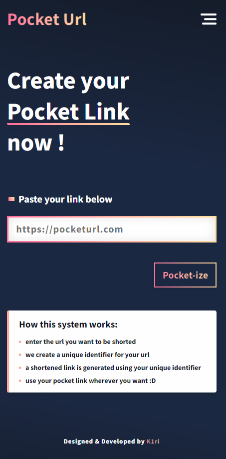
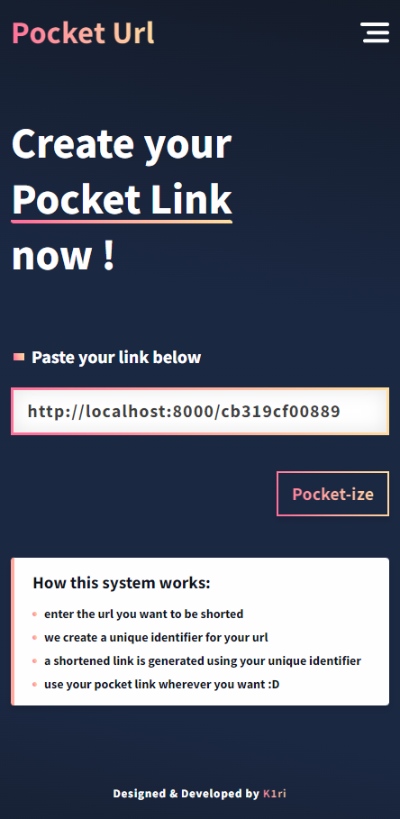

# Url Shortner





📌 A url shortener website, 'Pocket Url'

## 😎 Watch live

***not yet :'(***

## 🏠 Run Locally

Clone the project

```bash
  git clone https://github.com/K1riakos/url-shortener-laravel-vue.git
```

Go to the project directory

```bash
  cd url-shortener-laravel-vue
```

Install npm dependencies

```bash
  npm install
```

<br>

## ⚙️ Used

<br>

**👉 Coding**


<br>

**🖥️ Editor**


<br>

**🛠️ Version Control**


<br>

## 🙋🏻‍♂️ Author

**Kyriakos Kiri Sidiropoulos**
